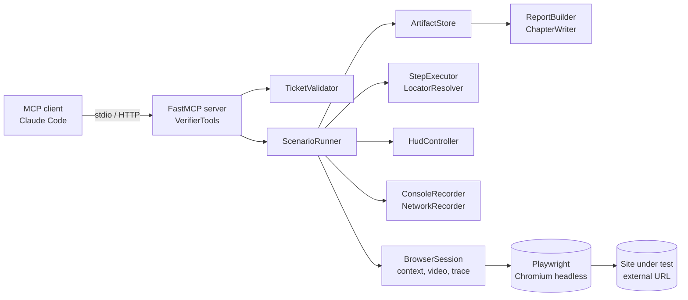
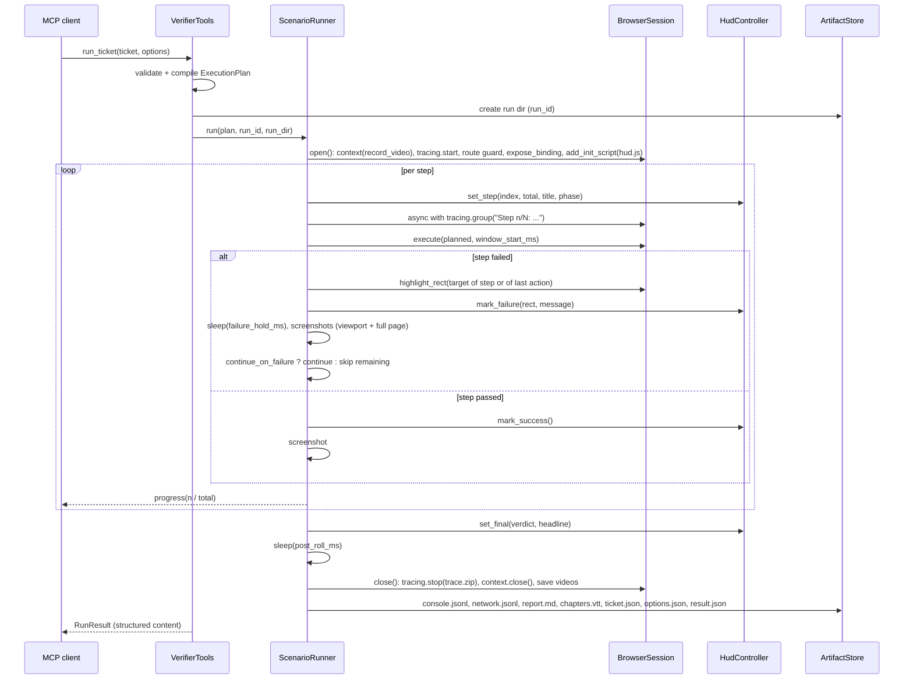

# Specification: `e2e-verifier` - MCP server for reproducing and verifying website bug tickets

| Field | Value |
|---|---|
| Version | 1.0 (implemented) |
| Date | 2026-09-10 |
| Platform | Python >= 3.12 (3.13 in use), FastMCP 3.4.x, Playwright 1.62.x |
| Project directory | `end_to_end_testmcp/` |
| Package | `e2e_verifier` |
| MCP server name | `e2e-verifier` |

---

## 1. Purpose and context

A website (built in a separate session, reachable under a local or remote URL) performs various
actions. At least one button does not do what it should. The misbehaviour is described in a bug
ticket that contains expected behaviour, observed behaviour and acceptance criteria.

The MCP server `e2e-verifier` accepts such a ticket (or a generic scenario), executes the described
steps in a real browser, checks the acceptance criteria and delivers traceable evidence:

1. **Annotated video** (`video.webm`): every step is shown with a banner; on failure a red frame
   marks the affected element and the error text is displayed. Audience: stakeholders, ticket
   attachment.
2. **Playwright trace** (`trace.zip`): DOM snapshots, network, console, timeline, sources.
   Audience: developers, root-cause analysis in the trace viewer.
3. **Structured result** (`result.json`) and **report** (`report.md`): machine- and human-readable
   verdict per step and per acceptance criterion.

The server is strictly separated from the site under test. It knows the site only through its URL
and the targets described in the ticket. It contains no LLM call; translating free text into
structured steps is the job of the MCP client (for example Claude Code).

### 1.1 Typical flow

```
Bug report (free text)  --->  MCP client (LLM) writes BugTicket JSON
                                        |
                                        v
                       e2e-verifier.run_ticket(ticket, options)
                                        |
        +-------------------------------+-------------------------------+
        v                               v                               v
  video.webm (HUD)                 trace.zip                   result.json / report.md
        |                               |                               |
        +---------------- resources runs://{run_id}/... -----------------+
```

---

## 2. Non-goals

The server does **not**:

- interpret free text or generate tests (no LLM inside the server),
- start, build or deploy the website; it expects a reachable URL,
- execute arbitrary JavaScript from a ticket (there is no `evaluate` step),
- support Selenium; Playwright is fixed (native video and trace, headless, no Xvfb, no screen
  grabbing),
- run cross-browser matrices; Chromium is the default, Firefox and WebKit can be selected per run
  but are not part of the quality gates,
- orchestrate CI, distribute runs across machines or use cloud grids,
- abstract OAuth/SSO login flows; a Playwright `storage_state` file can be supplied, nothing more.

---

## 3. Terms

| Term | Meaning |
|---|---|
| **Ticket** | Input object `BugTicket`: URL, reproduction steps, expected/actual behaviour, acceptance criteria. |
| **Scenario** | Input object `Scenario`: URL and steps without bug semantics. Generic case for other schemas. |
| **Step** | An action (`click`, `fill`, ...) or an assertion (`expect_visible`, ...). Both appear in the HUD, the trace and the report. |
| **Acceptance criterion** | Named condition in the ticket that references one or more assertion steps. |
| **Run** | One execution of a ticket or scenario. Produces exactly one run directory with all artifacts. |
| **Outcome** | Technical result of a run: `criteria_met`, `criteria_not_met`, `error`. |
| **Verdict** | Business reading of the outcome given the mode: `fixed`, `still_broken`, `reproduced`, `not_reproduced`, `passed`, `failed`, `inconclusive`. |
| **HUD** | Head-up display: overlay injected via `add_init_script`, visible in the video. |
| **Artifact** | File in the run directory: video, trace, screenshots, logs, report. |

---

## 4. Key decisions

| # | Decision | Rationale |
|---|---|---|
| D1 | Playwright (async API) instead of Selenium | Video (`record_video_dir`) and tracing (`tracing.start(screenshots, snapshots, sources)`) are built in. Selenium would need ffmpeg/x11grab or docker-selenium. |
| D2 | The trace is the primary analysis artifact, the video the primary communication artifact | The trace allows stepping back and forth with DOM state and network. The video shows stakeholders the failure without tooling. Both are always produced. |
| D3 | Annotation by DOM overlay, not by video post-processing | Playwright films the viewport, so everything in the DOM lands in the video. No ffmpeg pipeline required. |
| D4 | HUD inside a **closed** shadow root | Playwright locators pierce open shadow roots. A banner "Click Save" would otherwise match `get_by_text("Save")`. Closed shadow roots are not pierced. |
| D5 | Structured input (Pydantic), no free text | Determinism, validation with clear messages, JSON schema for the client. |
| D6 | No LLM inside the server | Reproducibility, testability, no API keys in the server. |
| D7 | One browser process per server lifetime, one context per run | Contexts are isolated (cookies, storage, video, trace) and cheap. The browser is relaunched only after a crash. |
| D8 | Two modes: `verify` and `reproduce` | The same ticket reproduces the bug before the fix and verifies it afterwards. Only the verdict is read differently. |
| D9 | Descriptions via decorator arguments and `Field(description=...)`, not docstrings | Rule: no comments and no docstrings in code. FastMCP accepts `description=` explicitly. |
| D10 | Host allowlist | The server drives a browser. Without an allowlist it is an SSRF tool. Default: `localhost`, `127.0.0.1`, `[::1]`. |
| D11 | English everywhere | Code strings, HUD texts, reports, README and this spec are English. |

---

## 5. Architecture

### 5.1 Components



| Component | Responsibility |
|---|---|
| `VerifierTools`, `RunResources`, `VerifierPrompts` | Register tools, resources and prompts on the FastMCP server. Translate MCP calls into application calls. No Playwright code. |
| `Settings` | Configuration from environment variables (`pydantic-settings`, prefix `E2E_`). |
| `TicketValidator` | Semantic checks beyond Pydantic: host allowlist, timeouts, fixture paths, criteria coverage, brittle selectors. |
| `PlanCompiler` | Normalises `BugTicket` and `Scenario` into an `ExecutionPlan` (ordered `PlannedStep`s, criteria, effective options, masked source). |
| `BrowserPool` | One Playwright instance and one browser per (name, headless, slow_mo) per process; relaunches after disconnects. |
| `BrowserSession` | Lifecycle of context and page: video, tracing, HUD init script, route guard, recorders, clean close. |
| `StepExecutor` / `StepRegistry` | One executor class per action or assertion type, registered by action name; the registry proves completeness at start. |
| `LocatorResolver` | Builds a Playwright locator from a `Target`. |
| `HudController` | Drives the overlay (`setStep`, `markFailure`, `setFinal`) and re-applies state after navigation. |
| `ConsoleRecorder`, `NetworkRecorder`, `DialogRecorder`, `DownloadRecorder` | Collect console, page errors, requests/responses, dialogs and downloads with time offsets. Serve assertions such as `expect_request`. |
| `ScenarioRunner` | Orchestrates a batch run: open session, execute steps, abort logic, timing, HUD, screenshots. |
| `InteractiveSession`, `SessionManager` | Agent-driven sessions: one step per tool call, annotations, inline screenshots, idle reaping (see 9.5). |
| `RunFinalizer` | Writes logs, report, chapters and `result.json` for batch runs and interactive sessions alike. |
| `OutcomeEvaluator`, `VerdictPolicy`, `SummaryComposer` | Derive outcome, verdict and a one-paragraph summary. |
| `ArtifactStore`, `RetentionPolicy` | Run directories, file names, atomic result writes, retention by count and age, `run_id` validation. |
| `RunRegistry` | Tracks running runs, lists and loads finished ones. |
| `ReportBuilder`, `ChapterWriter` | Produce `report.md` and `chapters.vtt`. |
| `TargetProbe`, `ElementDiscovery` | Lightweight sessions (no video/trace) for `probe_target` and `discover_elements`. |

### 5.2 Run sequence



### 5.3 Layers and dependency rules

```
e2e_verifier/
  server/        -> knows fastmcp, application, domain. No playwright.
  application/   -> runner, policies, store, exploration. Knows domain and the browser layer only through Protocols (ports.py).
  browser/       -> the only layer importing playwright.
  domain/        -> pydantic models, enums, settings, masking. No external dependency except pydantic.
  assets/        -> hud.js, discover.js.
```

Rule: imports point downwards only. `application` depends on `SessionPort`, `SessionFactoryPort`,
`HudPort` and `ProgressPort`; unit tests replace the browser with fakes.

---

## 6. Input schema

All models are Pydantic v2 models with `extra="forbid"`. The JSON schema is available through the
tool `get_schema` and the `schema://...` resources.

### 6.1 `BugTicket`

```json
{
  "id": "WEB-142",
  "title": "Save button does nothing",
  "url": "http://127.0.0.1:5173/settings",
  "description": "After entering a name and clicking Save nothing happens.",
  "environment": {"viewport": {"width": 1280, "height": 720}, "browser": "chromium", "locale": "en-US"},
  "preconditions": [{"id": "p1", "action": "goto", "url": "/settings"}],
  "steps": [
    {"id": "s1", "action": "fill", "target": {"label": "Name"}, "value": "Anna"},
    {"id": "s2", "action": "click", "target": {"role": {"role": "button", "name": "Save"}}},
    {"id": "s3", "action": "expect_visible", "target": {"role": {"role": "status", "name": "Saved"}}, "timeout_ms": 5000},
    {"id": "s4", "action": "expect_request", "method": "POST", "url_pattern": "**/api/settings", "status": 200, "timeout_ms": 5000},
    {"id": "s5", "action": "expect_no_console_errors"}
  ],
  "expected": "A toast 'Saved' appears and the settings are posted.",
  "actual": "No toast, no request, no console output.",
  "acceptance_criteria": [
    {"id": "AC1", "description": "Toast 'Saved' appears after the click", "step_ids": ["s3"]},
    {"id": "AC2", "description": "Settings are sent to /api/settings", "step_ids": ["s4"]},
    {"id": "AC3", "description": "No console errors during the flow", "step_ids": ["s5"]}
  ],
  "tags": ["settings", "regression"]
}
```

| Field | Type | Required | Rules |
|---|---|---|---|
| `id` | `str` | yes | 1-64 characters `[A-Za-z0-9._-]`. Shown in report and HUD banner, never used as a path. |
| `title` | `str` | yes | <= 200 characters. |
| `url` | `AnyHttpUrl` | yes | Base URL. Host must be on the allowlist. Relative `goto` URLs resolve against it. |
| `description` | `str` | no | Free text for the report. |
| `environment` | `Environment` | no | Viewport (default 1280x720), browser, locale, timezone, color scheme, `storage_state_path` (relative to `E2E_FIXTURE_DIR`). |
| `preconditions` | `list[Step]` | no | Steps before the reproduction steps (login, navigation). Shown as "Setup" in the HUD. A failure here yields outcome `error`, not `criteria_not_met`. |
| `steps` | `list[Step]` | yes | >= 1 step; ids unique across preconditions and steps. Without preconditions and without a leading `goto`, an implicit `goto` to `url` is prepended as a setup step. |
| `expected` / `actual` | `str` | yes / no | For report and summary. |
| `acceptance_criteria` | `list[AcceptanceCriterion]` | yes | >= 1. Each criterion references >= 1 assertion step in `steps` via `step_ids`. Referencing action steps, precondition steps or unknown ids is a validation error. |
| `tags` | `list[str]` | no | Metadata only. |

### 6.2 `Scenario`

Like `BugTicket` without `expected`, `actual` and `acceptance_criteria`. Every assertion step is
implicitly its own criterion. Scenarios always run in mode `verify` and produce the verdicts
`passed` / `failed` / `inconclusive`.

### 6.3 `Target` - element selection

Exactly **one** primary strategy must be set. `within`, `has_text` and `nth` are optional
refinements.

| Field | Type | Playwright mapping |
|---|---|---|
| `role` | `{"role": AriaRole, "name": str?, "exact": bool?}` | `get_by_role(role, name=, exact=)`; `role` is validated against the ARIA role list |
| `text` | `{"text": str, "exact": bool?}` | `get_by_text(text, exact=)` |
| `label` | `str` | `get_by_label(label)` |
| `placeholder` | `str` | `get_by_placeholder(placeholder)` |
| `test_id` | `str` | `get_by_test_id(test_id)` |
| `css` | `str` | `locator(css)` |
| `xpath` | `str` | `locator("xpath=" + xpath)` |
| `within` | `Target` | parent locator the primary strategy is applied on |
| `has_text` | `str` | `.filter(has_text=)` |
| `nth` | `int >= 0` | `.nth(n)` |

Recommended order for the client: `role` > `label` > `test_id` > `text` > `css` > `xpath`. The
validator warns about `css` and `xpath`. On strict-mode violations (several matches) the result
lists the candidates reported by Playwright so the client can refine the target.

### 6.4 Action steps

Common fields: `id`, `action` (discriminator), `title` (overrides the generated HUD text),
`timeout_ms` (overrides `step_timeout_ms`, 100-120000).

| `action` | Additional fields | Behaviour |
|---|---|---|
| `goto` | `url` (absolute or relative), `wait_until: load\|domcontentloaded\|networkidle` | Navigation. The resolved URL and the final URL are checked against the allowlist. |
| `click` | `target`, `button`, `click_count` (1-3), `force` | `locator.click()` |
| `dblclick` | `target` | `locator.dblclick()` |
| `fill` | `target`, `value`, `secret` | `locator.fill()`. With `secret` the value is masked in HUD, report, result and logs (see 14.4). |
| `type` | `target`, `text`, `delay_ms` (0-500) | `locator.press_sequentially()` |
| `press` | `target?`, `key` | `locator.press()` or `page.keyboard.press()` without target |
| `check` / `uncheck` | `target` | Checkboxes and radios |
| `select_option` | `target`, `value: str \| list[str]` | `locator.select_option()` |
| `hover` | `target` | `locator.hover()` |
| `scroll_into_view` | `target` | `locator.scroll_into_view_if_needed()` |
| `wait_for` | `target?` + `state: visible\|hidden\|attached\|detached`, or `load_state: load\|domcontentloaded\|networkidle` | Explicit waiting; exactly one of `target` / `load_state`. |
| `sleep` | `ms` (1-5000) | Only for animations; the validator warns. |
| `reload` | - | `page.reload()` |
| `go_back` | - | `page.go_back()` |
| `set_viewport` | `width`, `height` (200-4000) | `page.set_viewport_size()`; the video keeps its recording size. |
| `upload_file` | `target`, `path` | Only paths below `E2E_FIXTURE_DIR`. |

### 6.5 Assertion steps

Assertions use `playwright.async_api.expect` with the step timeout. A failed assertion is a
**criteria failure**, not an infrastructure error.

| `action` | Fields | Check |
|---|---|---|
| `expect_visible` | `target` | `to_be_visible()` |
| `expect_hidden` | `target` | `to_be_hidden()` (absent counts as hidden) |
| `expect_text` | `target`, `text`, `exact` | `to_have_text()` / `to_contain_text()` |
| `expect_value` | `target`, `value` | `to_have_value()` |
| `expect_attribute` | `target`, `name`, `value?` | `to_have_attribute()`; without `value` any value is accepted |
| `expect_enabled` / `expect_disabled` | `target` | `to_be_enabled()` / `to_be_disabled()` |
| `expect_checked` | `target`, `checked` | `to_be_checked()` |
| `expect_count` | `target`, `count` | `to_have_count()` |
| `expect_url` | `pattern` (glob or `re:` prefix) | `expect(page).to_have_url(regex)` |
| `expect_title` | `text` | `to_have_title()` with a contains-regex |
| `expect_request` | `method` (default `ANY`), `url_pattern`, `status?`, `body_contains?` | Waits on the `NetworkRecorder` until timeout: a request since the last action with matching method and URL glob, optionally with response status and body fragment. |
| `expect_no_request` | `method`, `url_pattern`, `within_ms` | No matching request since the last action within the window. |
| `expect_no_console_errors` | `ignore_patterns` | No `console.error` and no page error since the run start or since the previous `expect_no_console_errors`, ignoring regex patterns. |
| `expect_console_contains` | `level?`, `pattern` | At least one matching console entry. |
| `expect_dialog` | `type: alert\|confirm\|prompt`, `message_contains?`, `accept` | A dialog since the last action. The runner configures the dialog policy (accept/dismiss) before executing the preceding action. |
| `expect_storage` | `kind: local\|session`, `key`, `value?` | Value in `localStorage` / `sessionStorage`. |
| `expect_download` | `filename_pattern?` | A download since the last action. |

Extensibility: a new step is one Pydantic model (schema) plus one executor class (behaviour)
registered in `DefaultStepRegistry`; the registry raises at start-up if a step type has no executor.

### 6.6 `RunOptions`

| Field | Default | Meaning |
|---|---|---|
| `mode` | `verify` | `verify` or `reproduce` (see 7.2). Ignored for scenarios. |
| `base_url_override` | `null` | Replaces scheme, host and port of the ticket URL. Absolute `goto` URLs pointing at the original host are rewritten too. Needed because the site under test may change its port. |
| `browser` | ticket environment, else `E2E_BROWSER` | `chromium`, `firefox`, `webkit` |
| `headless` | `E2E_HEADLESS` | Headed mode is for local debugging; video is recorded either way. |
| `step_timeout_ms` | `E2E_DEFAULT_STEP_TIMEOUT_MS` (10000) | Timeout for actions and assertions without their own. |
| `run_timeout_s` | `E2E_DEFAULT_RUN_TIMEOUT_S` (120), capped by `E2E_MAX_RUN_TIMEOUT_S` (600) | Hard limit; on expiry the outcome is `error` and artifacts are still written. |
| `continue_on_failure` | `false` | With `false` all steps after the first failure are `skipped`. Errors always abort. |
| `failure_hold_ms` | 1500 | How long the red frame stays in the video before the run continues or ends. |
| `post_roll_ms` | 1000 | Tail after the final banner so the video does not cut off. |
| `slow_mo_ms` | 0 | Playwright `slow_mo`; 150-250 is recommended for stakeholder videos. |
| `record_har` | `false` | Additionally write `network.har`. |
| `screenshots` | `each_step` | `each_step`, `failure_only`, `none` |
| `hud` | `{enabled: true, position: "top", language: null, show_timer: true, show_ticket_id: true}` | HUD configuration; `language` defaults to `E2E_HUD_LANGUAGE`. |
| `label` | `null` | Free label shown by `list_runs`. |

---

## 7. Execution semantics

### 7.1 Step status

| Status | Meaning |
|---|---|
| `passed` | Action executed or assertion satisfied. |
| `failed` | Assertion not satisfied, or an action could not find its element within the timeout. |
| `error` | Infrastructure problem: site unreachable, browser crash, run timeout, strict-mode violation, host not allowed, invalid input such as a fixture path. |
| `skipped` | Not executed because an earlier step failed or errored and `continue_on_failure` is false. |

Classification of failures:

| Cause | Status | Category |
|---|---|---|
| Assertion timeout (`expect_*`) | `failed` | `assertion` |
| Element for an action not found (timeout on `click`, `fill`, ...) | `failed` | `element_not_found` |
| Navigation timeout | `failed` | `navigation` (error for `goto` in preconditions) |
| Strict-mode violation (several matches) | `error` | `ambiguous_target`, with candidates |
| Navigation to a host outside the allowlist (also via redirect) | `error` | `host_not_allowed` |
| `net::ERR_*` on `goto` | `error` | `navigation` |
| Browser or context crash | `error` | `browser` |
| Failure inside a precondition step | `error` | `precondition` |
| Run timeout | `error` | `run_timeout` (the step in progress is marked, the rest skipped) |

### 7.2 Outcome and verdict

**Outcome** (technical):

- `criteria_met`: all assertion steps referenced by criteria are `passed`.
- `criteria_not_met`: at least one referenced assertion step is `failed` or `skipped`.
- `error`: at least one step is `error` or the run was aborted.

**Verdict** (business, by mode):

| Kind / mode | `criteria_met` | `criteria_not_met` | `error` |
|---|---|---|---|
| ticket / `verify` | `fixed` | `still_broken` | `inconclusive` |
| ticket / `reproduce` | `not_reproduced` | `reproduced` | `inconclusive` |
| scenario | `passed` | `failed` | `inconclusive` |

Per criterion: `met` when all referenced steps passed, `not_met` when at least one failed,
`unknown` when none failed but some were skipped or errored. Evidence per criterion: the proving
step, its video offset, screenshot and trace group.

The mode also changes the HUD banner ("Verify" / "Reproduce") and the final banner tone: a
`reproduced` verdict is an expected failure and is shown in orange, `still_broken` and `failed` in
red, `fixed`, `not_reproduced` and `passed` in green, `inconclusive` in grey.

### 7.3 Timing

- The moment the browser context is created is the zero point of all offsets (the video starts
  there with a tolerance of a few hundred milliseconds, reported as `video_offset_uncertainty_ms`).
- Every step stores `started_offset_ms` and `ended_offset_ms`; console and network entries carry
  the same offsets plus the id of the step that was active.
- `requests_after_step` counts requests between the start of an action step and the start of the
  next action step. For "the button does nothing" a value of `0` is the direct indicator.

### 7.4 Abort and cleanup

- `run_timeout_s` wraps the whole run with `asyncio.timeout`. On expiry the HUD shows the error,
  tracing is stopped, the context is closed, artifacts are written, the outcome is `error`.
- Closing the session has its own timeout (`E2E_SESSION_CLOSE_TIMEOUT_S`, default 20). Failures
  while closing become warnings in the result; `result.json` is always written last.
- After a browser crash the pool launches a fresh browser for the next run.

### 7.5 Concurrency

- `E2E_MAX_PARALLEL_RUNS` (default 1) via `asyncio.Semaphore`; further calls wait.
- One Playwright object and one browser per process, started by the FastMCP lifespan (and lazily on
  first use) and stopped on shutdown.

---

## 8. Acceptance criteria

### 8.1 Evaluation

See 7.2. Criteria are evaluated from the step results; a scenario derives one criterion per
assertion step.

### 8.2 Acceptance criteria for the server itself (verified by tests)

For every run, including runs that end in `error`:

1. `result.json`, `report.md`, `trace.zip` and `video.webm` exist and are not empty. If the browser
   cannot start, video and trace are missing and `result.json` says so in `warnings`.
2. Every step has a visible banner in the video with index, title and status.
3. A failed step with a resolvable element has a red frame around it and the error text in the
   banner for at least `failure_hold_ms`.
4. The trace contains one group per step named after the step (`tracing.group`).
5. HUD content never influences an assertion (`get_by_text` on banner text finds 0 elements;
   clicks through the banner reach the page).
6. The verdict follows the table in 7.2.
7. No run exceeds `run_timeout_s` by more than the session close timeout.

---

## 9. MCP interface

### 9.1 Tools

All tools return Pydantic models (FastMCP emits `structuredContent`). Business failures (bug
reproduced, site timed out) are **results**, not exceptions. Only input and security problems raise
`fastmcp.exceptions.ToolError`.

| Tool | Signature | Purpose |
|---|---|---|
| `get_schema` | `(kind: ticket\|scenario\|run_options\|run_result) -> dict` | JSON schema for the client. |
| `validate_ticket` | `(ticket: BugTicket, options?) -> ValidationReport` | Semantic validation without a browser: `ok`, `errors[]`, `warnings[]` with codes such as `host_not_allowed`, `unreferenced_assertion`, `brittle_selector`, `secret_in_trace`. Never raises. |
| `run_ticket` | `(ticket: BugTicket, options?: RunOptions) -> RunResult` | Main tool. Reports progress per step via `ctx.report_progress` and `ctx.info`; validation warnings are logged via `ctx.warning`. Validation errors raise `ToolError`. |
| `run_scenario` | `(scenario: Scenario, options?) -> RunResult` | Same without bug semantics. |
| `get_run` | `(run_id) -> RunResult` | Stored result; `ToolError` when unknown or still running. |
| `list_runs` | `(limit=20, ticket_id?, outcome?) -> list[RunSummary]` | Newest first. |
| `get_artifact` | `(run_id, kind, index?) -> File \| ArtifactLocation` | Inline (`EmbeddedResource`, base64) up to `E2E_MAX_INLINE_ARTIFACT_MB`, otherwise a path with size. Kinds: `video`, `video_mp4`, `trace`, `report`, `result`, `ticket`, `screenshot` (with `index`), `console_log`, `network_log`, `har`, `chapters`. |
| `delete_run` | `(run_id) -> DeleteResult` | Deletes the run directory; running runs cannot be deleted. |
| `probe_target` | `(url) -> ProbeResult` | Opens the URL once: reachable, status, title, load time, final URL, console/page errors. |
| `discover_elements` | `(url, query?, steps_before?, max_results=20) -> DiscoveryResult` | ARIA snapshot of the page plus candidates matching the query (tag, role, name, test id, css path, visibility, rect) each with a suggested `Target`. `steps_before` can log in or navigate first. |
| `server_info` | `() -> ServerInfo` | Versions, configuration without secrets, artifact directory, run counts. |

Registration: `VerifierTools` is a class whose `register(mcp)` calls
`mcp.tool(self.method, name=..., description=...)` for each bound method. FastMCP injects the
`Context` parameter and excludes it from the input schema. `get_artifact` is registered with
`output_schema=None` because `File` has no JSON schema.

### 9.2 Resources

| URI | Content | MIME |
|---|---|---|
| `schema://ticket`, `schema://scenario`, `schema://run-options`, `schema://run-result` | JSON schema | `application/json` |
| `runs://index` | `RunSummary[]` | `application/json` |
| `runs://{run_id}/result`, `.../ticket` | `result.json`, masked `ticket.json` | `application/json` |
| `runs://{run_id}/report` | `report.md` | `text/markdown` |
| `runs://{run_id}/video` | `video.webm` | `video/webm` |
| `runs://{run_id}/trace` | `trace.zip` | `application/zip` |
| `runs://{run_id}/screenshots/{index}` | PNG, zero-based index in sorted order | `image/png` |
| `runs://{run_id}/console`, `.../network` | ndjson logs | `application/x-ndjson` |
| `runs://{run_id}/chapters` | WebVTT | `text/vtt` |
| `runs://{run_id}/har` | HAR when `record_har` was on | `application/json` |

Binary resources are delivered as blobs. Above the inline limit the resource returns an
`ArtifactLocation` JSON document instead.

### 9.3 Prompts

| Prompt | Arguments | Content |
|---|---|---|
| `ticket_from_report` | `report_text`, `base_url` | Instructions for turning a free-text report into a `BugTicket`: schema embedded, target preferences, `discover_elements` recommended, every criterion mapped to assertions, `validate_ticket` before `run_ticket`. |
| `analyze_run` | `run_id` | Embeds `result.json` and the tails of console and network logs; asks for a root-cause hypothesis and which trace group to open. |
| `refine_target` | `run_id`, `step_id` | Embeds the locator, error and Playwright's candidate list; asks for a more precise `Target`. |

### 9.4 Transport

- Default `stdio` (Claude Code, local clients). Logging goes to stderr only.
- Optional `http` (Streamable HTTP) via `E2E_TRANSPORT=http`, `E2E_HTTP_HOST`, `E2E_HTTP_PORT`.
  No authentication; binding to anything but a loopback address requires
  `E2E_ALLOW_REMOTE_BIND=true`, otherwise the server refuses to start.

### 9.5 Interactive session tools

Batch execution assumes that the steps are known. When another agent has to *find out* what a
site does (agent-to-agent testing), it drives the site step by step through a recorded session.
The session id is a run id: artifacts land in the same run directory and are served by the same
`get_artifact` tool and `runs://` resources.

| Tool | Signature | Purpose |
|---|---|---|
| `session_open` | `(url, options?: RunOptions) -> [SessionOpened JSON, screenshot]` | Opens a recorded browser context (video, trace, HUD, logs), navigates to `url` as step 1 and returns the session id plus a JPEG screenshot as image content. |
| `session_act` | `(session_id, step: Step, include_screenshot=true) -> [ActResult JSON, screenshot]` | Executes one action or assertion. The HUD shows "Step n: title"; a failed assertion draws the red frame (own target, else the target of the last action) but does **not** end the session. The result lists new console/page errors and the number of requests since the previous step plus a hint. |
| `session_annotate` | `(session_id, message, target?, tone=info\|success\|failure, hold_ms=1500) -> [AnnotationResult JSON, screenshot]` | Draws a callout (and a frame around `target` when given) into the video for `hold_ms` and stores `screenshots/noteNNN_<tone>.png`. |
| `session_screenshot` | `(session_id, full_page=false) -> [text, screenshot]` | Stores `screenshots/shotNNN.png` and returns the image. |
| `session_inspect` | `(session_id, query?, max_results=20) -> DiscoveryResult` | ARIA snapshot and candidate targets of the current page without changing it. |
| `session_close` | `(session_id, verdict?, summary?) -> RunResult` | Shows the final banner, stops tracing, saves the video and writes all artifacts. Verdict and summary default to the scenario evaluation of the executed assertions (`passed` / `failed` / `inconclusive`); the agent may override them (for example `reproduced`). |
| `session_list` | `() -> list[SessionInfo]` | Open sessions with idle time and counts. |

Rules:

- Step ids must be unique per session; duplicates are suffixed (`s1_2`).
- Each session has a lock, so concurrent tool calls on the same session are serialized.
- `E2E_MAX_SESSIONS` (3) limits open sessions; `E2E_SESSION_IDLE_TIMEOUT_S` (600) closes idle
  ones automatically and still writes their artifacts; the server shutdown closes all sessions.
- Inline screenshots are JPEG (`E2E_INLINE_SCREENSHOT_QUALITY`, default 70) to keep tool results
  small; the files on disk are PNG.
- The HUD banner shows "Step n" without a total, and annotations use their own frame and callout
  so they can coexist with a step failure frame.

Implementation: `application/interactive.py` (`InteractiveSession`, `SessionManager`) reuses the
step executors, the HUD controller and `RunFinalizer` (`application/finalize.py`), the same
component that writes the artifacts of batch runs.

---

## 10. Recording: video, trace, logs

### 10.1 Video

```python
context = await browser.new_context(
    viewport=viewport,
    record_video_dir=run_dir / "video_raw",
    record_video_size=viewport,
    locale=..., timezone_id=..., color_scheme=..., storage_state=...,
    record_har_path=run_dir / "network.har" if options.record_har else None,
)
```

- `record_video_size` equals the viewport so nothing is scaled.
- After `context.close()` every page's `Video.save_as()` writes the file; the main page becomes
  `video.webm`, popups become `video_popup_{n}.webm`; `video_raw/` is deleted.
- With `E2E_FFMPEG_PATH` set, `video.mp4` (H.264, yuv420p, faststart) is produced additionally; a
  failing conversion is a warning, not an error.
- `chapters.vtt` contains one cue per step from `started_offset_ms` to `ended_offset_ms` with
  title and status.

### 10.2 Trace

```python
await context.tracing.start(title=f"{ticket.id} - {ticket.title}", screenshots=True, snapshots=True, sources=True)
async with await context.tracing.group(f"Step {n}/{total}: {title}"):
    ...
await context.tracing.stop(path=run_dir / "trace.zip")
```

- In Playwright 1.62 `tracing.group()` is a coroutine that returns an async context manager
  which calls `group_end()` on exit.
- Preconditions are grouped as `Setup n/N: ...`, steps as `Step n/N: ...`.
- Open with `uv run playwright show-trace runs/<run_id>/trace.zip` or at
  https://trace.playwright.dev (drag and drop; the file never leaves the machine).
- The HUD is part of the DOM snapshots on purpose; its host element is `<e2e-hud>`.

### 10.3 Screenshots

- `screenshots=each_step`: a viewport screenshot after every step, `screenshots/{index:03d}_{status}.png`.
- On failure an additional full-page screenshot `screenshots/{index:03d}_failure_fullpage.png`
  **with** the HUD frame.
- Screenshots are taken after the HUD update so banner and frame are included.

### 10.4 Console, errors, network

- Listeners: `page.on("console")`, `page.on("pageerror")`, `page.on("dialog")`,
  `page.on("download")`, `context.on("request" | "response" | "requestfailed")`. Popups are
  attached through `context.on("page")`.
- `console.jsonl`: `{offset_ms, level, text, location, step_id}`; page errors use level
  `pageerror` and include the stack.
- `network.jsonl`: `{offset_ms, phase: request|response|failed, method, url, status, resource_type, failure_text, step_id}`.
- Bodies are not stored (privacy, size) unless `record_har=true`.
- Logs are capped at `E2E_MAX_LOG_ENTRIES` (10000); the result reports `truncated`.

---

## 11. HUD overlay

### 11.1 Requirements

| # | Requirement |
|---|---|
| H1 | Injected with `context.add_init_script(hud.js)` before the first navigation; runs in every new document including popups. |
| H2 | Host element `<e2e-hud>` with a **closed** shadow root; all styles live inside (`:host { all: initial }`). |
| H3 | Mounted on `document.documentElement` as soon as it exists; a `MutationObserver` re-mounts the host if the page removes it. |
| H4 | `pointer-events: none`, `position: fixed`, `z-index: 2147483647`, `aria-hidden="true"`, `data-e2e-hud="1"`. The HUD never intercepts a click and is invisible to the accessibility tree. |
| H5 | Banner (top or bottom): ticket id, mode, "Step n/N" or "Setup n/N", step title, status colour, elapsed time. |
| H6 | Failure state: red 4 px frame as its own fixed element around the rectangle supplied by the server (the target element is not touched), plus a callout with the error text and the message in the banner. |
| H7 | Success state: green banner until the next step. |
| H8 | Final state: full-width banner "Result: reproduced - ..." in the verdict tone. |
| H9 | State is idempotent: the init script asks the server for the current state through the exposed binding `__e2eHudState`, so the banner is restored immediately after every navigation; the server additionally re-applies state on `load`. |
| H10 | Fixed texts in `en` and `de`; step titles come from the ticket. |
| H11 | No network access, no fonts, no images; system font stack. |
| H12 | No influence on layout or scroll position. |

### 11.2 JavaScript API on `window.__e2eHud`

| Method | Parameter | Effect |
|---|---|---|
| `setState(state)` | full state object | Replaces the state (used for re-injection). |
| `setStep(step)` | `{index, total, title, phase, status}` | New step; clears failure and final state. |
| `markSuccess()` | - | Status `passed`. |
| `markFailure(failure)` | `{rect \| null, message}` | Draws the frame (with `rect`) and shows the message. |
| `markError(message)` | - | Grey banner with message. |
| `setFinal(final)` | `{verdict, message}` | Final banner. |
| `getState()` | - | Current state (used by tests). |

The server calls these through `page.evaluate` with data arguments, never by interpolating text
into script source.

### 11.3 Choosing the frame target on failure

1. The `target` of the failed step, if it resolves to exactly one element with a bounding box.
2. Otherwise the `target` of the last successful **action** step (typical case: "click Save, then
   no toast" - the frame surrounds the button and the callout shows the assertion message).
3. Otherwise no frame, banner text only.

The element is scrolled into view before the rectangle is measured.

### 11.4 Limits

- Elements inside cross-origin iframes get no frame (rectangles are frame-relative); rules 2/3 apply.
- Elements that disappear during `failure_hold_ms` leave the frame at the old position.
- The banner covers a 48 px strip; move it with `hud.position = "bottom"` when needed. Visibility
  assertions are unaffected because Playwright ignores `pointer-events: none` elements during hit
  testing, and clicks pass through the banner (covered by a test).

---

## 12. Artifacts and storage

### 12.1 Layout

```
E2E_ARTIFACT_DIR/
  runs/
    01J9X0...ULID/            <- run_id (ULID, time-sortable)
      ticket.json             <- input as received, secrets masked
      options.json            <- effective options
      result.json             <- RunResult, written last and atomically
      report.md
      video.webm
      video.mp4               <- optional
      trace.zip
      chapters.vtt
      console.jsonl
      network.jsonl
      network.har             <- optional
      screenshots/
        001_passed.png
        002_passed.png
        003_failed.png
        003_failure_fullpage.png
```

### 12.2 Rules

- `run_id` is a server-generated ULID. Every tool validates it against
  `^[0-9A-HJKMNP-TV-Z]{26}$` **before** building a path. Nothing from the ticket becomes a path.
- Retention after every run: runs beyond `E2E_MAX_RUNS_RETAINED` (50) or older than
  `E2E_MAX_ARTIFACT_AGE_H` (168) are deleted, oldest first; running runs and the run just finished
  are protected.
- `result.json` is written via temp file + rename; its existence marks a finished run.
- Absolute paths in results are meant for a local client such as Claude Code.

### 12.3 Limits

| Limit | Default | Behaviour |
|---|---|---|
| `E2E_MAX_INLINE_ARTIFACT_MB` | 8 | Larger artifacts are returned as `ArtifactLocation`. |
| Log entries per run | 10000 | Further entries are counted, not stored (`truncated: true`). |

---

## 13. Configuration

`Settings` (`pydantic-settings`, prefix `E2E_`, `.env` is read):

| Variable | Default | Description |
|---|---|---|
| `E2E_ARTIFACT_DIR` | `artifacts` | Root for runs. |
| `E2E_ALLOWED_HOSTS` | `localhost,127.0.0.1,[::1]` | Comma separated; `*.example.test` wildcards allowed. |
| `E2E_ALLOW_ANY_HOST` | `false` | Disables the allowlist. |
| `E2E_BROWSER` | `chromium` | Default browser. |
| `E2E_HEADLESS` | `true` | - |
| `E2E_DEFAULT_STEP_TIMEOUT_MS` | `10000` | - |
| `E2E_DEFAULT_RUN_TIMEOUT_S` / `E2E_MAX_RUN_TIMEOUT_S` | `120` / `600` | Default and cap per run. |
| `E2E_MAX_PARALLEL_RUNS` | `1` | - |
| `E2E_MAX_RUNS_RETAINED` / `E2E_MAX_ARTIFACT_AGE_H` | `50` / `168` | Retention. |
| `E2E_MAX_INLINE_ARTIFACT_MB` | `8` | - |
| `E2E_MAX_LOG_ENTRIES` | `10000` | - |
| `E2E_FIXTURE_DIR` | unset | Root for `upload_file` paths and `storage_state_path`. |
| `E2E_FFMPEG_PATH` | unset | Optional mp4 export. |
| `E2E_TRANSPORT` | `stdio` | `stdio` or `http`. |
| `E2E_HTTP_HOST` / `E2E_HTTP_PORT` | `127.0.0.1` / `8765` | - |
| `E2E_ALLOW_REMOTE_BIND` | `false` | - |
| `E2E_LOG_LEVEL` | `INFO` | stderr logging. |
| `E2E_HUD_LANGUAGE` | `en` | Default HUD language. |
| `E2E_SESSION_CLOSE_TIMEOUT_S` | `20` | Timeout for closing a browser session. |

Settings are loaded once at start and passed explicitly to the components; there is no global
access.

---

## 14. Security

### 14.1 Host allowlist

- Applies to the ticket URL, `goto` targets, `base_url_override`, `probe_target` and
  `discover_elements`; the validator rejects violations before a browser starts.
- At runtime a `context.route("**/*")` guard aborts main-frame navigation requests to hosts outside
  the allowlist (`blockedbyclient`), including redirects, and the step ends with
  `host_not_allowed`. Sub-resources (CDN, fonts) are not affected.

### 14.2 No code from the ticket

There is no `evaluate` step. Ticket strings are passed as data to locator APIs
(`get_by_role(name=...)`, `fill(value)`) and to `page.evaluate` as arguments, never interpolated
into script text.

### 14.3 File system

- `run_id` validation (12.2).
- `upload_file` and `storage_state_path` are resolved below `E2E_FIXTURE_DIR` with
  `Path.resolve()` and `is_relative_to`.

### 14.4 Secrets

- `fill` with `secret: true`: the value is replaced by `***` in `ticket.json`, `result.json`,
  `report.md`, step error messages, the HUD and logs.
- **Known limit:** the Playwright trace records action parameters, so the value is inside
  `trace.zip`. The validator emits the warning `secret_in_trace`. Use throw-away test accounts.

### 14.5 Resources

- Semaphore for parallel runs, hard run timeouts, session close timeout, retention.
- `sleep` is capped at 5000 ms per step, `discover_elements` at 100 candidates.

---

## 15. Result format

### 15.1 `RunResult` (abridged)

```json
{
  "run_id": "01J9X0Q3M6WZ2M8Y4K7P1R5T9V",
  "kind": "ticket",
  "ticket_id": "WEB-142",
  "title": "Save button does nothing",
  "mode": "reproduce",
  "outcome": "criteria_not_met",
  "verdict": "reproduced",
  "summary": "Bug reproduced: step s3 (Expect status \"Saved\" to be visible) failed: Timed out 5000ms waiting for expect(locator).to_be_visible() ... Requests after last action (Click button \"Save\"): 0. 0 console errors, 0 page errors, 0 failed requests.",
  "started_at": "2026-09-10T10:52:13.412Z",
  "finished_at": "2026-09-10T10:52:24.907Z",
  "duration_ms": 11495,
  "video_offset_uncertainty_ms": 300,
  "browser": {"name": "chromium", "version": "140.0.7339.16", "headless": true, "viewport": {"width": 1280, "height": 720}},
  "target_url": "http://127.0.0.1:5173/settings",
  "steps": [
    {"index": 1, "id": "__open__", "phase": "preconditions", "action": "goto", "title": "Open page \"http://127.0.0.1:5173/settings\"", "status": "passed", "started_offset_ms": 310, "ended_offset_ms": 890, "screenshot": "screenshots/001_passed.png", "trace_group": "Setup 1/5: Open page \"http://127.0.0.1:5173/settings\""},
    {"index": 3, "id": "s2", "phase": "steps", "action": "click", "title": "Click button \"Save\"", "status": "passed", "started_offset_ms": 1530, "ended_offset_ms": 1701, "screenshot": "screenshots/003_passed.png"},
    {"index": 4, "id": "s3", "phase": "steps", "action": "expect_visible", "title": "Expect status \"Saved\" to be visible", "status": "failed", "started_offset_ms": 1720, "ended_offset_ms": 6744,
     "error": {"category": "assertion", "message": "Timed out 5000ms waiting for expect(locator).to_be_visible() ...", "locator": "get_by_role('status', name='Saved')", "highlight_target": {"source": "previous_action", "step_id": "s2", "rect": {"x": 412, "y": 388, "width": 120, "height": 40}}, "candidates": []},
     "screenshot": "screenshots/004_failed.png", "failure_screenshot": "screenshots/004_failure_fullpage.png", "trace_group": "Step 4/5: Expect status \"Saved\" to be visible"},
    {"index": 5, "id": "s4", "phase": "steps", "action": "expect_request", "title": "Expect request POST **/api/settings", "status": "skipped"}
  ],
  "acceptance_criteria": [
    {"id": "AC1", "description": "Toast 'Saved' appears after the click", "status": "not_met", "step_ids": ["s3"], "evidence": {"step_id": "s3", "video_offset_ms": 1720, "screenshot": "screenshots/004_failure_fullpage.png", "trace_group": "Step 4/5: ..."}},
    {"id": "AC2", "description": "Settings are sent to /api/settings", "status": "unknown", "step_ids": ["s4"], "evidence": null}
  ],
  "observations": {"console_errors": 0, "page_errors": 0, "failed_requests": 0, "requests_total": 14, "requests_after_step": {"__open__": 13, "s1": 0, "s2": 0}, "dialogs": 0, "downloads": 0, "truncated": false},
  "artifacts": {"dir": "C:/.../artifacts/runs/01J9X0Q3M6WZ2M8Y4K7P1R5T9V", "video": "video.webm", "video_mp4": null, "trace": "trace.zip", "report": "report.md", "chapters": "chapters.vtt", "console_log": "console.jsonl", "network_log": "network.jsonl", "har": null, "screenshots": ["screenshots/001_passed.png", "..."], "popup_videos": []},
  "warnings": [],
  "run_error": null
}
```

### 15.2 `report.md` structure

```
# WEB-142 - Save button does nothing
Verdict: **reproduced** (mode `reproduce`) · Run `01J9X0...` · 2026-09-10 10:52 UTC · chromium 140 headless

## Summary
Bug reproduced: step s3 ... Expected: ... Actual: ...

## Acceptance criteria
| ID | Criterion | Status | Evidence |

## Steps
| # | Step | Status | Video | Duration | Detail |

## Observations
- Console errors, page errors, failed requests, requests total, requests after step ...

## Artifacts
- Video, trace (open with `playwright show-trace`), logs, screenshots

## Input
<details>ticket.json</details>
```

---

## 16. Example: "the Save button does nothing"

Reproduction before the fix:

```
run_ticket(ticket=<6.1>, options={"mode": "reproduce", "base_url_override": "http://127.0.0.1:5173", "slow_mo_ms": 150})
-> verdict: reproduced, step s3 failed, red frame around the Save button
```

Verification after the fix, same ticket:

```
run_ticket(ticket=<6.1>, options={"mode": "verify", "base_url_override": "http://127.0.0.1:5173"})
-> verdict: fixed, all criteria met
```

The client attaches `video.webm` to the ticket and points developers to `trace.zip`.

---

## 17. Project structure, tooling, code rules

### 17.1 Structure

```
end_to_end_testmcp/
  pyproject.toml  uv.lock  .python-version  README.md  spec.md
  src/e2e_verifier/
    __init__.py  __main__.py  py.typed
    server/      app.py (ServerFactory, PoolLifespan)  tools.py  resources.py  prompts.py  versions.py
    application/ clock.py  compiler.py  validation.py  runner.py  verdict.py  observations.py
                 ports.py  store.py  registry.py  report.py  chapters.py  video.py
                 exploration.py  hosts.py  urls.py  fixtures.py
    browser/     session.py (BrowserPool, BrowserSessionFactory, BrowserSession)  hud.py
                 locator.py  recorders.py  executors/{base,actions,assertions,registry}.py
    domain/      common.py  enums.py  errors.py  aria.py  steps.py  ticket.py  options.py
                 result.py  settings.py  masking.py
    assets/      hud.js  discover.js  loader.py
  tests/
    conftest.py               fixture HTTP server, settings, browser pool, ticket factory
    fixtures/site/            index.html, app.js, settings.html (working Save, broken Delete, error button, dialog)
    unit/                     models, targets, compiler, verdict, store, report/chapters, settings/hosts/urls,
                              masking/validation, runner with fake session, no-comments guard
    integration/              happy path, broken button, HUD, trace/video/HAR, allowlist/timeouts,
                              discovery/probe, MCP client roundtrip
```

### 17.2 `pyproject.toml` (essentials)

- `requires-python >= 3.12`; dependencies `fastmcp>=3.1,<4`, `playwright>=1.61,<2`,
  `pydantic>=2.11`, `pydantic-settings>=2.10`, `python-ulid>=3`.
- Dev group: `pytest`, `pytest-asyncio`, `pytest-timeout`, `mypy`, `ruff`.
- ruff: `select = ["ALL"]`, line length 100, target py312, curated ignore list (docstring rules,
  copyright, type-checking-block rules for pydantic models, blind-except, a few async file rules).
- mypy: `strict = true`, `warn_unreachable`, `disallow_any_generics`, pydantic plugin.
- pytest: `asyncio_mode = "auto"`, `timeout = 90`, marker `integration`.

### 17.3 Code rules

1. **No comments, no docstrings.** MCP descriptions via `description=` and `Field(description=...)`.
   `tests/unit/test_no_comments.py` enforces it for `src/` (Python via `tokenize`/`ast`, JavaScript
   via line prefixes).
2. **OOP.** Every component is a class with explicit constructor dependencies. Module-level functions
   only as entry points (`main`). No module state except constants.
3. **Protocols at layer boundaries** (`application/ports.py`) so unit tests replace the browser.
4. **Discriminated unions** for steps (`Field(discriminator="action")`) for precise schemas.
5. **No `Any` leaks.** `mypy --strict` is a gate.
6. **Async throughout.** Playwright async API, async FastMCP tools; blocking work (ffmpeg) via
   subprocesses.
7. **Errors as values inside a run.** `StepOutcome` / `StepError` are data; exceptions only for
   programming and input errors.
8. **No stdout logging.** stdio transport owns stdout; logs go to stderr and to `ctx.info`.
9. **Deterministic titles.** Generated step titles follow fixed templates so reports are comparable.
10. **English only.**

### 17.4 Commands

```
uv sync
uv run playwright install chromium
uv run ruff format .
uv run ruff check .
uv run mypy src tests
uv run pytest tests/unit
uv run pytest tests/integration/test_run_ticket_broken_button.py -x --timeout=120
uv run e2e-verifier
```

---

## 18. Test strategy

### 18.1 Fixture site

`tests/fixtures/site/` is a static mini app that mirrors the ticket scenario: a "Name" field, a
working **Save** button (shows a `role="status"` toast "Saved", posts to `/api/settings`, stores
the name in `localStorage`), a broken **Delete** button (no-op handler), a **Trigger error** button
(`console.error` + throw), a **Confirm** button (dialog), a fixed-position button underneath the HUD
banner, and a link to `settings.html`. The fixture server (`ThreadingHTTPServer`, port 0) answers
`POST /api/settings` with 200, offers `/slow` (8 s delay) and `/redirect-external` (redirect to a
host outside the test allowlist).

### 18.2 Unit tests (no browser)

Models and discriminators, target validation, plan compilation (implicit goto, phases, overrides,
secrets), verdict table and criterion evaluation, artifact store (ULID validation, atomic writes,
retention), report and chapters, settings/allowlist/URL patterns, masking and validation, the
runner with a fake session (abort, continue-on-failure, precondition errors, run timeout, masking),
and the no-comments guard.

### 18.3 Integration tests (Chromium headless, marker `integration`)

| Test | Proves |
|---|---|
| happy path | verdict `fixed`, `video.webm` > 10 kB, `trace.zip` with `.trace` and `resources/`, one screenshot per step, chapters, request counting |
| broken button | verdict `reproduced` in mode `reproduce`, `still_broken` in mode `verify`, highlight on the previous action with a real rectangle, full-page failure screenshot, `requests_after_step == 0`, criteria `not_met` / `unknown` |
| HUD | closed shadow root (`get_by_text` on banner text finds nothing), frame rectangle in `getState()`, click through the banner, state restored after navigation, HUD can be disabled |
| trace and video | every trace group name is inside `trace.zip` (JSON-escaped), HAR written, logs contain the API call |
| allowlist and timeouts | foreign host rejected with `ToolError` before the browser starts; redirect to a foreign host ends with `host_not_allowed`; run timeout yields `error` with artifacts |
| discovery and probe | probe of the fixture site and of a closed port; `discover_elements` finds the Save button with a `test_id` target; `steps_before` navigates first |
| MCP client | in-memory `fastmcp.Client`: tool list, `ctx` excluded from schema, validation, schema, `run_ticket` with progress events, `list_runs`, `get_run`, `runs://.../report`, `get_artifact` blob, screenshot resource, `server_info`, `delete_run` |

### 18.4 Rules for test runs

- Run integration tests **per file** with `--timeout=120`; a hanging browser must not eat the session.
- No test touches an external network; the redirect test uses `localhost` vs `127.0.0.1`.
- Test artifacts live in `tmp_path`.

### 18.5 Quality gates (all green on 2026-09-10)

```
uv run ruff format --check .
uv run ruff check .
uv run mypy src tests
uv run pytest tests/unit                      (86 tests)
uv run pytest tests/integration/<file>.py     (14 tests across 7 files)
```

---

## 19. Integration with Claude Code

`.mcp.json` in the project that contains the website (or globally):

```json
{
  "mcpServers": {
    "e2e-verifier": {
      "command": "uv",
      "args": ["run", "e2e-verifier"],
      "env": {
        "E2E_ARTIFACT_DIR": "artifacts",
        "E2E_ALLOWED_HOSTS": "localhost,127.0.0.1"
      }
    }
  }
}
```

Typical client session:

1. `probe_target("http://127.0.0.1:5173")` - is the site up?
2. `discover_elements(url, query="Save")` - which targets exist?
3. Write the ticket (prompt `ticket_from_report`), `validate_ticket`.
4. `run_ticket(mode="reproduce")` - attach video and trace to the ticket.
5. After the fix: `run_ticket(mode="verify")`.

---

## 20. Assumptions and open points

| # | Point | Decision |
|---|---|---|
| A1 | The original request trailed off at the acceptance criteria. | Criteria live **inside the ticket** and are encoded as assertion steps (8.1); section 8.2 defines criteria for the server itself. |
| A2 | Free-text tickets | The client translates; the server stays deterministic. |
| A3 | URL and port of the site under test vary. | `base_url_override` in `RunOptions`; allowlist contains loopback hosts by default. |
| A4 | Video format | WebM (Playwright native); mp4 only with ffmpeg configured. |
| A5 | Secrets in the trace | Known limit (14.4); a v2 could pause tracing chunks around secret steps. |
| A6 | Cross-origin iframes | No frame; fallback rules (11.3). A `frame` field on `Target` is a v2 option. |
| A7 | Trace format | The internal trace format is not a public contract; the test searches for group names tolerantly. |
| A8 | Dialog policy | `expect_dialog.accept` is applied to the dialog raised by the preceding action; dialogs without an expectation are accepted so runs never block. |
